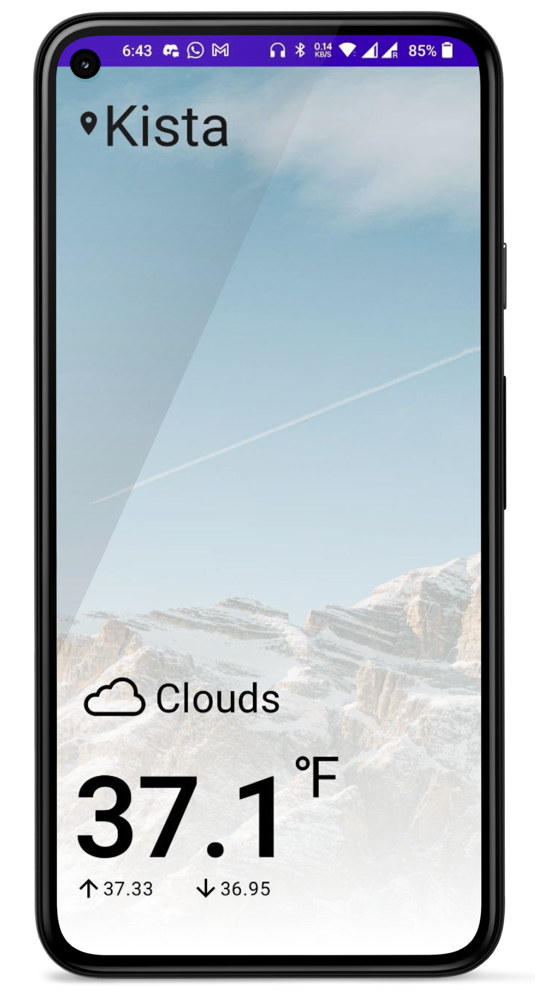

# Weather
Weather app | MVVM | Kotlin | Flow | Hilt | Unit Tests

## Application Scope
**Weather** app displays current weather based on the user's location. The app uses the [OpenWeatherMap] API to load data and uses **imperial** as a default unit of measurement.

#### Technical information
- Android studio last version
- JDK 8
- Android SDK 33
- Supports API Level +23

#### Tech-Stack
- Kotlin, Coroutines, Kotlin flow, Extension
- Retrofit
- View binding
- MVVM, Clean Architecture
- Hilt dependency injection
- Unit testing

#### Libraries & Dependencies
- [Support libraries]: AppCompat / ConstraintLayout
- [Easy Permission]: To simplify basic system permissions logic when targeting Android M or higher.
- [Retrofit]: A type-safe HTTP client for Android
- [Hilt]: Dependency injection library for Android that reduces the boilerplate of doing manual dependency injection in the project.
- [MockK]: Mocking library for Kotlin
- [Turbine]: Turbine is a small testing library for kotlinx.coroutines Flow
- [Truth]: Fluent assertions for Java and Android

# Steps to run project:
1. Download or clone the proejct from github URL.
2. Open Android Studio File > New > Import project
3. Build and Run the project.

# App Usage:
On app start, the app will request for location permission if not already granted. Once the permision is granted, it will get the current location and make an api call to retrieve the weather data. Upon success, it will display the weather information. The app will show an error message if something goes wrong along the whole process.

                                                    

# Project Structure :
- [Data]: Contains network object models, api and repository.
- [DI]: Contains custom application and modules for dependency injection.
- [Domain] : Contains domain model **use case** and extensions.
- [Presentation] : Contains activity, fragments, viewmodel and extension of view classes.
- [Tests]: Contains the unit test for usecase and viewmodel.

# Scope of Improvement :
1. Cache and display last update weather information in case of network unavailablity.
2. Display hourly and daily weather forecast.
3. Take city name as input.
4. Add UI tests.
5. Provide option to choose the unit of measurement.

# Requirements
1. Show weather data based on location.
2. Take city name as input to fetch its weather.

[OpenWeatherMap]: https://openweathermap.org/
[Support libraries]: https://developer.android.com/jetpack/androidx/
[Easy Permission]: https://github.com/googlesamples/easypermissions
[Retrofit]: https://github.com/square/retrofit
[Hilt]: https://developer.android.com/training/dependency-injection/hilt-android
[MVVM]: https://developer.android.com/topic/architecture
[MockK]: https://mockk.io/
[Turbine]: https://github.com/cashapp/turbine
[Truth]: https://github.com/google/truth

[Data]: app/src/main/java/org/bad_coder/weather/data
[DI]: master/app/src/main/java/org/bad_coder/weather/di
[Domain]: app/src/main/java/org/bad_coder/weather/domain
[Presentation]: app/src/main/java/org/bad_coder/weather/presentation
[Tests]: app/src/test/java/org/bad_coder/weather
